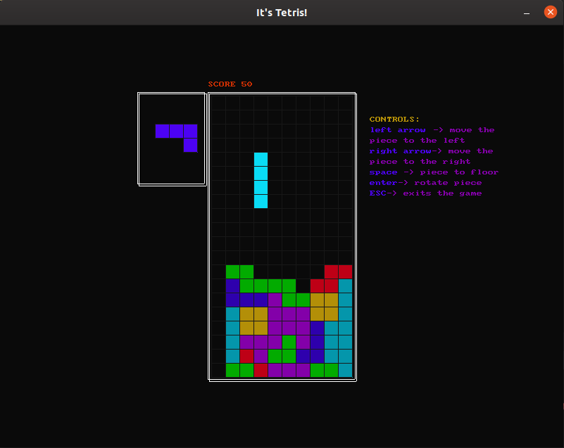

# Tetris

This implementation of the Tetris game was developed for the course `Programming and Data Structures in C` in Politechnika Łódzka.

Since its inception the project has been rewritten to use SDL2, you can find the original implementation using SDL1.2 [here](https://github.com/epergo/tetris-C/tree/SDL1.2)
